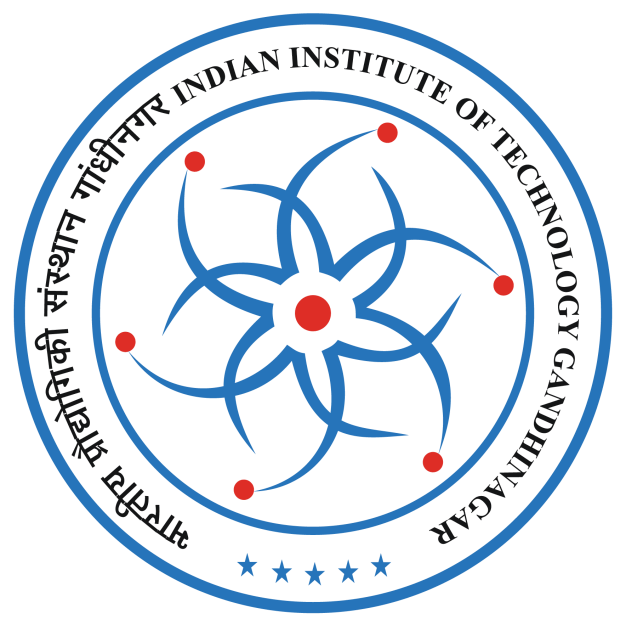
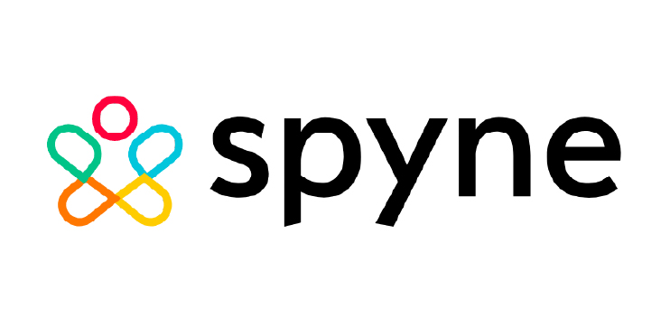

Hello! I am a fully funded M.S. Computer Science (Thesis Track) student at the University of Illinois Urbana-Champaign. My research interests lie in multimodal multi-agent systems, error-free LLM-driven code generation, and program repair using LLMs.

I am currently working with [Prof. Sasa Misailovic](https://misailo.cs.illinois.edu/) on **enhancing the semantic accuracy of LLM-generated code through grammar-guided generation**. Additionally, as part of my CS598 project, I am working under the guidance of [Prof. Lingming Zhang](https://lingming.cs.illinois.edu/) on **automatic software debugging using small language models**. Previously, I collaborated with [Prof. Heng Ji](https://blender.cs.illinois.edu/hengji.html) and [Prof. Unnat Jain](https://unnat.github.io/) to design a **multi-agent framework** for complex VQA tasks—this work was recently submitted to ACL '25!

I earned my BTech with Honours in Computer Science and Engineering from IIT Gandhinagar, where I conducted research under the guidance of [Prof. Nipun Batra](https://nipunbatra.github.io/) and [Prof. Shanmuganathan Raman](https://sites.google.com/site/shanmuganathanraman/) on probabilistic machine learning (and its applications) and generative adversarial networks, respectively.

During my second-year summer internship, I had the opportunity to work with [Prof. A.G. Ramakrishnan](http://mile.ee.iisc.ac.in/AGR/index.htm) at IISc Bangalore, focusing on natural language processing tasks. In my third-year summer internship, I worked with [Prof. Aki Vehtari](https://users.aalto.fi/~ave/) at Aalto University on reducing divergences encountered during Hamiltonian Monte Carlo sampling. I also worked as a computer vision intern at [Spyne.ai](https://spyne.ai/), where I focused on Virtual Try-On. In addition to my research, I was featured as a contributor in [Dr. Kevin Murphy](https://www.cs.ubc.ca/~murphyk/)'s book, *Probabilistic Machine Learning: Advanced Topics*, in recognition of my contributions.

I’m actively seeking internship opportunities for Summer 2025. If you believe I’d be a great fit for your team, feel free to reach out at **madhav3@illinois.edu**. I’d love to connect!

---

## Affiliations

  

    
    
IIT Gandhinagar <em>2020-2024</em>

  

  
  

    
    
Spyne.ai <em>2022</em>

  

  

    
    
Indian Institute of Science <em>2022</em>

  

  

    
    
Aalto University <em>2023</em>

  

  

    
    
UIUC <em>2024-2026</em>

  

---

## News

<!-- 
  Fixed height news container with a scrollbar.
-->

  <!-- Single news item -->
  

    
Aug 2024

    
Excited to start my second chapter as a Fully Funded MS CS student at UIUC!

  

  <!-- Single news item -->
  

    
Jun 2024

    
Awarded the Institute Gold Medal at IIT Gandhinagar for Outstanding Performance.

  

  <!-- Single news item -->
  

    
Feb 2024

    
Received an offer for the Caltech SURF program from Prof. Tapio Schneider in the CliMA group.

  

  
  

    
Feb 2024

    
Among the two students nominated by IIT Gandhinagar for the prestigious Pre-Doctoral Research Assistant Program at Microsoft Research India.

  

  
  <!-- Single news item -->
  

    
Jan 2024

    
Selected for Google Research Week 2024—exploring cutting-edge ML techniques with top experts.

  

  <!-- Single news item -->
  

    
Sep 2023

    
Selected for Amazon ML Summer School!

  

  <!-- Single news item -->
  

    
Mar 2023

    
Among the 50 applicants selected for the Aalto University research program out of 1,600+ applicants across 84 countries.

  

  

    
Sep 2022

    
Awarded Academic Research Ranking 2 in the Computer Science and Engineering department at IIT Gandhinagar.

  

  
  

      
Aug 2022

      
Mentioned as a contributor in Dr. Kevin Murphy‘s Probabilistic Machine Learning: Advanced Topics book

  

  

    
Apr 2022

    
Awarded Indian Academy of Sciences Summer Research Fellowship.

  

  <!-- Add more items as needed... -->

